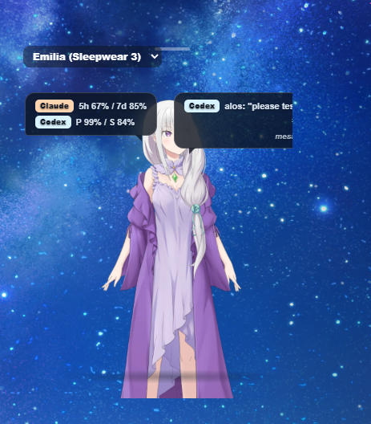
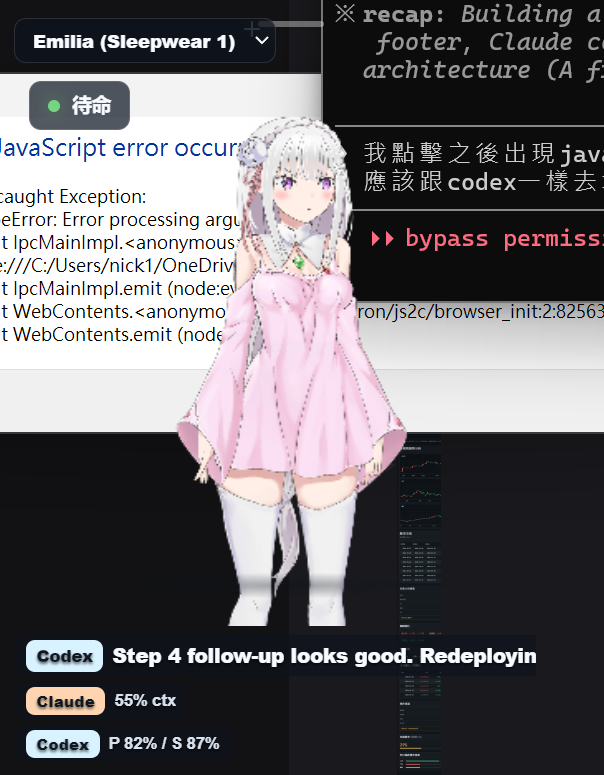

[繁體中文](README.md) · **English** · [日本語](README.ja.md)

# ✨ Emilia Claude / Codex Live2D Widget

A Live2D desktop companion for watching Claude Code and Codex status from the corner of your screen.

<p align="center">
  
</p>

<p align="center">
  <strong>Windows · Electron 30 · Vue 3 · FastAPI</strong>
</p>

## Features

- 🎀 Character picker with 10 Emilia outfit variants.
- 😊 Tap the character for an expression motion and a random voice line.
- 🖱️ Hold and drag the character to place the widget anywhere on your desktop.
- 📊 Live Codex / Claude quota display: Claude 5h/7d, Codex P/S.
- ⚙️ Adjustable zoom, resolution, FPS, always-on-top, hair physics, subtitles, and volume.
- 🪟 Transparent, frameless, always-on-top Electron widget.
- 🔌 Local monitoring for Claude Code and Codex CLI sessions, with no hosted backend.

## Screenshots

<p align="center">
  
</p>

The main view shows Emilia Live2D, Claude / Codex quota bubbles, and footer status chips. This is a reference image for the README and can be replaced with a newer capture.

<p align="center">
  
</p>

The older view is kept as a visual reference for comparing the bubble layout, character placement, and transparent-window behavior.

## Setup

Prerequisites: Node.js 20+, [uv](https://astral.sh/uv), PowerShell 5+, and your own extracted Re:Zero LiM Live2D character files.

```powershell
# 1) Clone
git clone https://github.com/Alos21750/emilia-claude-codex-cli-live2d-widget.git
cd emilia-claude-codex-cli-live2d-widget

# 2) Frontend
cd frontend
npm install

# 3) Backend (uv-managed)
cd ../server
uv venv
uv sync

# 4) Live2D character assets — needs YOUR copy of the ReZero LiM Live2D files
cd ../frontend
pwsh ./scripts/setup-emilia-models.ps1 -Source "<path to ReZero LiM Live2D Characters\Live2D Characters>"
```

## Optional: voice clips

Voice clips are optional local-only assets. The setup script runs `yt-dlp` through `uvx` on demand, so there is no global `yt-dlp` install. The voices are copyrighted; use them only for personal, non-commercial experiments.

```powershell
winget install ffmpeg
# uv supplies yt-dlp on demand (winget install astral-sh.uv if you don't have it yet)
cd frontend
pwsh ./scripts/setup-emilia-voices.ps1
```

The script generates 51 short clips for common moods and interactions. This README does not reproduce any voice-line text.

## Run

```powershell
# Easy (Windows): double-click launch.bat
# Or manually in 3 terminals:
cd server && .venv\Scripts\python.exe main.py
cd frontend && npm run dev
cd frontend && npm run electron:dev
```

To override the default window size, set these before starting Electron:

```powershell
$env:WIDGET_WIDTH=320
$env:WIDGET_HEIGHT=460
npm run electron:dev
```

## Customization

The gear panel includes:

- **Zoom** 0.5×–2.0× — character size.
- **Resolution** 1×–4× — Pixi super-sampling for sharper edges.
- **FPS** 15/30/60/120.
- **Always on top** — toggle window pinning.
- **Hair physics** — toggle physics; turn it off if a specific Emilia variant jitters.
- **Voice on tap** — enable or disable voice playback on tap.
- **Subtitle** — show subtitles on tap.
- **Volume** 0–100.

## Troubleshooting

- Character is stuck in a corner or disappears: reload, or close and reopen the widget. This is usually an HMR edge case.
- Hair still jitters: raise Resolution to 3× or 4×; for some outfits, try turning Hair physics off.
- No sound: run `setup-emilia-voices.ps1`; `ffmpeg` is required.

## Architecture

- Frontend: Vue 3 + PixiJS + `pixi-live2d-display` inside a transparent frameless Electron window.
- Backend: slim FastAPI process tailing `~/.codex/sessions` and `~/.claude/projects` JSONL files, plus an Anthropic OAuth `/usage` proxy.
- WebSocket `session_state` stream for real-time updates.
- 100% local, with no external services besides the Claude OAuth quota fetch.

## Credits & licensing

This project is **derived from** [Dylin-code/agents-stage-live2d-vrm3d](https://github.com/Dylin-code/agents-stage-live2d-vrm3d). The session-bridge architecture, Claude OAuth usage proxy, and core session monitoring ideas are the original author's work; this fork narrows the scope into a single Windows desktop widget.

Live2D character assets are © 雷瑟莉雅, Re:Zero -Starting Life in Another World- Lost in Memories, and their respective rightsholders, for personal non-commercial use only. This repo does not commit character models or voice assets; users must provide or generate them locally.

`pixi-live2d-display`, PixiJS, Vue, Electron, FastAPI, and other third-party packages retain their original MIT, MPL, or other licenses. Optional voice clips are user-provided from a public source and generated locally for personal use only.

## License

MIT, see [LICENSE](./LICENSE).
